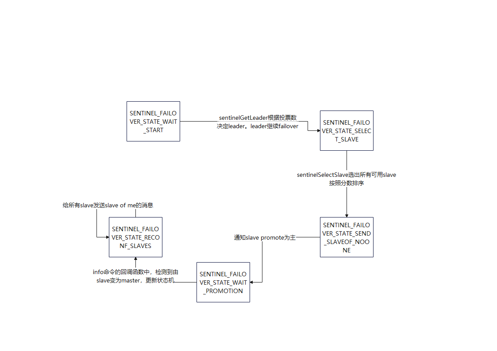

# sentinel概念及设计
本文分析是以redis6.0版本为例。redis基本每个大版本会增加数万行代码。6.0在增加了集群功能的基础上，代码相对少一些。
## sentinel作用
sentinel是redis部署中的运维进程，主要作用是替代人力完成包括，监控redis实例状态，主备倒换等工作。

因为单台sentinel可能出现故障，影响redis实例的主备倒换，所以sentinel一般以集群形式部署。
## 集群角色
提供包括master，slave，sentinel等三种角色。master处理所有写请求，同时将写更新同步给slave。slave处理读请求。sentinel监控master故障与否，如果故障执行主备倒换选主。

# 代码逻辑及数据结构
## sentinel初始化
server.c的main入口中，判断如果打开sentinel_mode，执行sentinel相关变量初始化以及命令表。重点包括
```
//sentinel为全局变量
struct sentinelState {
    char myid[CONFIG_RUN_ID_SIZE+1]; /* This sentinel ID. */
    uint64_t current_epoch;         /* Current epoch. */
    dict *masters;      /* Dictionary of master sentinelRedisInstances.
                           Key is the instance name, value is the
                           sentinelRedisInstance structure pointer. */
    int tilt;           /* Are we in TILT mode? */
    int running_scripts;    /* Number of scripts in execution right now. */
    mstime_t tilt_start_time;       /* When TITL started. */
    mstime_t previous_time;         /* Last time we ran the time handler. */
    list *scripts_queue;            /* Queue of user scripts to execute. */
    char *announce_ip;  /* IP addr that is gossiped to other sentinels if
                           not NULL. */
    int announce_port;  /* Port that is gossiped to other sentinels if
                           non zero. */
    unsigned long simfailure_flags; /* Failures simulation. */
    int deny_scripts_reconfig; /* Allow SENTINEL SET ... to change script
                                  paths at runtime? */
} sentinel;
```

sentinel-redis-instance状态包括如下：
```
#define SRI_MASTER  (1<<0)
#define SRI_SLAVE   (1<<1)
#define SRI_SENTINEL (1<<2)
#define SRI_S_DOWN (1<<3)   /* Subjectively down (no quorum). */
#define SRI_O_DOWN (1<<4)   /* Objectively down (confirmed by others). */
#define SRI_MASTER_DOWN (1<<5) /* A Sentinel with this flag set thinks that
                                   its master is down. */
#define SRI_FAILOVER_IN_PROGRESS (1<<6) /* Failover is in progress for
                                           this master. */
#define SRI_PROMOTED (1<<7)            /* Slave selected for promotion. */
#define SRI_RECONF_SENT (1<<8)     /* SLAVEOF <newmaster> sent. */
#define SRI_RECONF_INPROG (1<<9)   /* Slave synchronization in progress. */
#define SRI_RECONF_DONE (1<<10)     /* Slave synchronized with new master. */
#define SRI_FORCE_FAILOVER (1<<11)  /* Force failover with master up. */
#define SRI_SCRIPT_KILL_SENT (1<<12) /* SCRIPT KILL already sent on -BUSY */
```
## sentinel命令表
一个redis实例如果以sentinel形式启动，则会修改redisCommands为sentinelCmds。具体如下：
```
struct redisCommand sentinelcmds[] = {
    {"ping",pingCommand,1,"",0,NULL,0,0,0,0,0},
    {"sentinel",sentinelCommand,-2,"",0,NULL,0,0,0,0,0},
    {"subscribe",subscribeCommand,-2,"",0,NULL,0,0,0,0,0},
    {"unsubscribe",unsubscribeCommand,-1,"",0,NULL,0,0,0,0,0},
    {"psubscribe",psubscribeCommand,-2,"",0,NULL,0,0,0,0,0},
    {"punsubscribe",punsubscribeCommand,-1,"",0,NULL,0,0,0,0,0},
    {"publish",sentinelPublishCommand,3,"",0,NULL,0,0,0,0,0},
    {"info",sentinelInfoCommand,-1,"",0,NULL,0,0,0,0,0},
    {"role",sentinelRoleCommand,1,"ok-loading",0,NULL,0,0,0,0,0},
    {"client",clientCommand,-2,"read-only no-script",0,NULL,0,0,0,0,0},
    {"shutdown",shutdownCommand,-1,"",0,NULL,0,0,0,0,0},
    {"auth",authCommand,2,"no-auth no-script ok-loading ok-stale fast",0,NULL,0,0,0,0,0},
    {"hello",helloCommand,-2,"no-auth no-script fast",0,NULL,0,0,0,0,0}
};
```
其中与redis IO实例不同的命令包括
```
sentinelCommand, sentinelPublishCommand, sentinelInfoCommand, sentinelRoleCommand
```

### sentinel INFO [section]
命令sentinel汇报当前状态，主要为进程信息以及sentinel变量中信息，如监控master的状态，地址等。
section支持all,default,server,clients,cpu,stats。具体内容通过server.c中genRedisInfoString函数生成，包括内存使用，客户端连接数，持久化rdb.aof等信息,kvstats统计。

### sentinel ROLE
命令sentinel返回监控master的实例名。

### PUBLISH channel msg
sentinel的publish命令只能发送给__sentinel__:hello频道，用于加入集群的广播通知。所有集群内的sentinel会监控该频道，新sentinel则会向该频道广播。sentinelProcessHelloMessage处理加入消息，
```
消息包括8个字段
/* Format is composed of 8 tokens:
     * 0=ip,1=port,2=runid,3=current_epoch,4=master_name,
     * 5=master_ip,6=master_port,7=master_config_epoch. */
```
内部逻辑
1. 通过消息mastername是否与当前master重合，确认消息发送者和接收者是否在一个集群。不在则丢弃消息。
2. 根据ip,port,runid在sentinel中找redisInstance。如果不存在，则首先删除相同runid的其他redisInstance。同时创建消息中的实例，触发+sentinel事件。
3. 如果消息epoch号大于sentinel的epoch，更新epoch同时出发+new-epoch事件。
4. 如果消息master-epoch大于sentinel的master-epoch，代表master信息有过变化。更新master地址。

### sentinelCommand sentinel专属命令
1. masters
返回sentinel监控的所有master name,ip,port,runid,状态等信息。如果是master节点，还会返回slave个数，config-epoch，quorum，failover-timeout等配置。
2. master master-name
如上
3. slaves/replicas master-name
如上，返回对应master的slave节点信息。
4. sentinels master-name
如上。
5. is-master-down-by-addr ip port current-epoch runid
用ip,port等标识master，因为不同集群可能用相同的master-name标识一个master，但是ip,port不会相同。
runid如果不为*，则代表发送者希望接收sentinel选举runid为failover的sentinel leader。
sentinelVoteLeader中，sentinel给对应runid的sentinel投票，如果请求的epoch大于记录的leader-epoch，则更新当前节点master的leader信息。并返回两者中更大的epoch，这样发送者就可以知道自己的leader-vote被没被sentinel接受。
6. reset pattern
清理符合pattern的所有master内存选举状态,sentinel集群状态。=
7. get-master-addr-by-name master-name
获取master的地址信息。
8. failover master-name
通知master选举slave作为新主，开始主备倒换。
9. pending-scripts
获取所有pending-scripts的执行上下文和执行状态
10. monitor name ip port quorum
创建一个master类型sentinelRedisInstance，结构体内容如下：
```
typedef struct sentinelRedisInstance {
    int flags;      /* See SRI_... defines */
    char *name;     /* Master name from the point of view of this sentinel. */
    char *runid;    /* Run ID of this instance, or unique ID if is a Sentinel.*/
    uint64_t config_epoch;  /* Configuration epoch. */
    sentinelAddr *addr; /* Master host. */
    instanceLink *link; /* Link to the instance, may be shared for Sentinels. */
    mstime_t last_pub_time;   /* Last time we sent hello via Pub/Sub. */
    mstime_t last_hello_time; /* Only used if SRI_SENTINEL is set. Last time
                                 we received a hello from this Sentinel
                                 via Pub/Sub. */
    mstime_t last_master_down_reply_time; /* Time of last reply to
                                             SENTINEL is-master-down command. */
    mstime_t s_down_since_time; /* Subjectively down since time. */
    mstime_t o_down_since_time; /* Objectively down since time. */
    mstime_t down_after_period; /* Consider it down after that period. */
    mstime_t info_refresh;  /* Time at which we received INFO output from it. */
    dict *renamed_commands;     /* Commands renamed in this instance:
                                   Sentinel will use the alternative commands
                                   mapped on this table to send things like
                                   SLAVEOF, CONFING, INFO, ... */

    /* Role and the first time we observed it.
     * This is useful in order to delay replacing what the instance reports
     * with our own configuration. We need to always wait some time in order
     * to give a chance to the leader to report the new configuration before
     * we do silly things. */
    int role_reported;
    mstime_t role_reported_time;
    mstime_t slave_conf_change_time; /* Last time slave master addr changed. */

    /* Master specific. */
    dict *sentinels;    /* Other sentinels monitoring the same master. */
    dict *slaves;       /* Slaves for this master instance. */
    unsigned int quorum;/* Number of sentinels that need to agree on failure. */
    int parallel_syncs; /* How many slaves to reconfigure at same time. */
    char *auth_pass;    /* Password to use for AUTH against master & replica. */
    char *auth_user;    /* Username for ACLs AUTH against master & replica. */

    /* Slave specific. */
    mstime_t master_link_down_time; /* Slave replication link down time. */
    int slave_priority; /* Slave priority according to its INFO output. */
    mstime_t slave_reconf_sent_time; /* Time at which we sent SLAVE OF <new> */
    struct sentinelRedisInstance *master; /* Master instance if it's slave. */
    char *slave_master_host;    /* Master host as reported by INFO */
    int slave_master_port;      /* Master port as reported by INFO */
    int slave_master_link_status; /* Master link status as reported by INFO */
    unsigned long long slave_repl_offset; /* Slave replication offset. */
    /* Failover */
    char *leader;       /* If this is a master instance, this is the runid of
                           the Sentinel that should perform the failover. If
                           this is a Sentinel, this is the runid of the Sentinel
                           that this Sentinel voted as leader. */
    uint64_t leader_epoch; /* Epoch of the 'leader' field. */
    uint64_t failover_epoch; /* Epoch of the currently started failover. */
    int failover_state; /* See SENTINEL_FAILOVER_STATE_* defines. */
    mstime_t failover_state_change_time;
    mstime_t failover_start_time;   /* Last failover attempt start time. */
    mstime_t failover_timeout;      /* Max time to refresh failover state. */
    mstime_t failover_delay_logged; /* For what failover_start_time value we
                                       logged the failover delay. */
    struct sentinelRedisInstance *promoted_slave; /* Promoted slave instance. */
    /* Scripts executed to notify admin or reconfigure clients: when they
     * are set to NULL no script is executed. */
    char *notification_script;
    char *client_reconfig_script;
    sds info; /* cached INFO output */
} sentinelRedisInstance;
```
11. flushconfig
将config刷盘
12. remove master-name
删除监控master
13. ckquorum master-name
判断集群中可用sentinel的数量，是否大于quorum配置以及sentinels总数的一般以上。大于才能进行投票。
14. set key value
更新sentinel配置
15. info-cache master-name
返回master的info信息，info信息从redisInstance的info缓存中获取，如果没有缓存则返回空。
16. simulate-failure
模拟故障，主要是设置sentinel的simfailure_flags标记位。
# 重要流程
## sentinel选新主
### 选主前提
1. SRI没有主观或者客观down
2. 连接没有断链
3. 连接上次消息时间不超过5倍的ping周期。
4. info消息时间不超过一定时长。
### 选主排序
compareSlavesForPromotion函数中实现，排序优先级
1. slave_priority：越小越好
2. slave_repl_offset：复制主更新的进度，越大越好
3. runid：字符序越小越好。
## sentinel failover
failover是一个状态机,状态机调度在sentinelTimer->sentinelFailoverStateMachine，如图所示：


## sentinelTimer定时任务
### tilt模式检查
是一种保护机制，如果两次sentineltimer之间的时间过长，代表负载过慢或系统时钟有问题，此时sentinelHandleRedisInstance中的一些常规检查不会执行。

### master实例handle
针对所有master以及slave和sentinel，sentinelHandleRedisInstance更新状态信息。
包括
1. cc(command-link)和pc(pubsub-link)连接的断链重连
2. 周期性发送ping和info消息。
3. 依赖通讯时间是否超时，检查subjecttive异常。依赖主观异常sentinel的数量判断是否objective异常。首先通知其他sentinel节点检查master状态，开启failover状态机，再次通知其他sentinel节点投自己票作为leader。

### 脚本相关命令
todo


